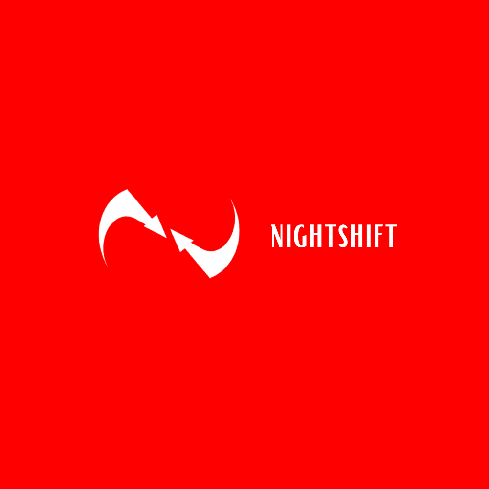
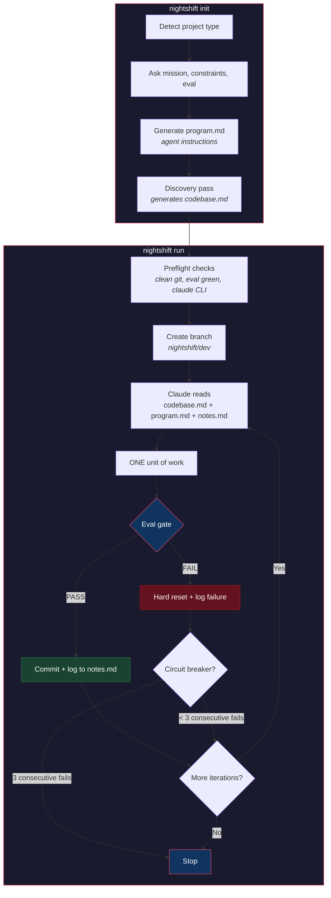
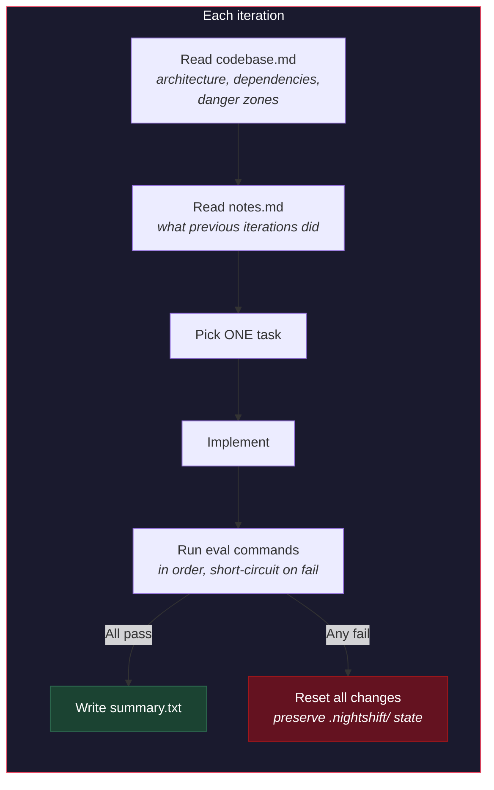

<p align="center">
  
</p>

<h1 align="center">nightshift</h1>

<p align="center">
  Autonomous overnight development loop for <a href="https://docs.anthropic.com/en/docs/claude-code">Claude Code</a>. Sleep while your codebase ships.
</p>

Nightshift runs Claude in a headless loop. Each iteration: Claude picks one unit of work, completes it, and an eval gate (your tests, typecheck, lint) verifies quality. Pass = commit. Fail = reset and retry. Wake up to a branch with N CI-green commits.

## Quick Start

```bash
npm i -g nightshift-dev
cd your-project
nightshift init    # interactive setup
nightshift run     # start the loop
nightshift status  # check progress
```

**Only dependency:** Claude Code CLI installed and authenticated.

## How It Works



### The loop in detail



## Init

`nightshift init` walks you through:

1. **Project detection** - scans for package.json, Cargo.toml, pyproject.toml, go.mod
2. **Mission** - what should the agent work on? (features, improvements, both, or custom)
3. **Constraints** - what should it NOT touch?
4. **Eval gate** - auto-detects test/typecheck/lint commands, you confirm or edit
5. **program.md generation** - uses Claude to generate tailored agent instructions

Creates `.nightshift/` with:
- `config.json` - your eval commands, branch, limits
- `program.md` - the agent's instruction set (you own this, edit freely)
- `codebase.md` - auto-generated codebase overview (generated on first run)
- `notes.md` - cross-iteration context (managed by nightshift)
- `logs/` - per-iteration Claude output

## Eval Gate

An ordered array of shell commands that must all exit 0:

```json
{
  "eval": [
    "npm test",
    "npm run typecheck",
    "npm run lint"
  ]
}
```

Commands run in order. First failure short-circuits. The failing command is logged so the next iteration knows what went wrong.

Auto-detection supports: Node.js (npm/pnpm/yarn/bun), Python (pytest/mypy/ruff), Rust (cargo test/clippy), Go (go test/vet), and Makefile targets.

## Config

`.nightshift/config.json`:

| Field | Default | Description |
|---|---|---|
| `eval` | `[]` | Shell commands for the quality gate |
| `branch` | `nightshift/dev` | Git branch to work on |
| `maxIterations` | `20` | Max iterations per run |
| `maxConsecutiveFailures` | `3` | Circuit breaker threshold |
| `timeout` | `900` | Seconds per iteration (15 min) |
| `model` | `claude-opus-4-6` | Claude model to use |
| `exclude` | `[]` | Directories to exclude |

CLI overrides: `nightshift run --iterations 50 --timeout 1800 --branch nightshift/feature-x`

## Discovery Pass

During `nightshift init`, after generating program.md, a discovery pass generates `.nightshift/codebase.md`. This is a structured, CTO-level overview of your codebase:

| Section | What It Captures |
|---|---|
| **Purpose** | What the project does, who it serves |
| **Architecture** | System map, major modules, data flow |
| **Dependency Map** | "If you change X, check Y" for every major module |
| **Key Patterns** | Error handling, validation, naming conventions |
| **Invariants** | Things that must never break (API contracts, security, schemas) |
| **Style Guide** | Observed formatting, test patterns, import order |
| **Danger Zones** | High blast-radius files and why they're dangerous |

Every iteration reads this before touching code. This prevents the #1 agent failure mode: changing a file without realizing 12 other files import from it.

If your project already has a `CLAUDE.md`, nightshift reads it as input but generates its own file focused on *understanding* (architecture, dependencies) rather than *instructions* (what to do).

## Key Design Decisions

**Discovery before work.** The agent maps the entire codebase before writing a single line. Like a CTO onboarding a new engineer: understand the system first, then change it.

**Bash loop, not Node loop.** The core orchestrator is a shell script. Zero runtime deps for a process that runs 8+ hours unattended.

**One unit of work per iteration.** Small, atomic, eval-gated commits. This is what makes 30+ commits overnight possible.

**Notes carry-forward.** Each iteration reads what previous ones did via notes.md. No memory system needed.

**Reset on failure, not fix on failure.** If eval fails, hard reset and try fresh. Prevents the agent from spiraling into patch-on-patch loops.

**No daemon, no server.** `nightshift run` is a foreground process. Run it in tmux/screen. Ctrl+C to stop.

## Tips

- **Review program.md before your first run.** It's the single biggest lever for quality.
- **Start with 5-10 iterations** to calibrate, then scale up.
- **Tighten constraints after the first run.** If the agent did low-impact work, add "focus on X, not Y" to program.md.
- **Run in tmux/screen** so it survives terminal disconnects.

## License

MIT
